<div align="center">

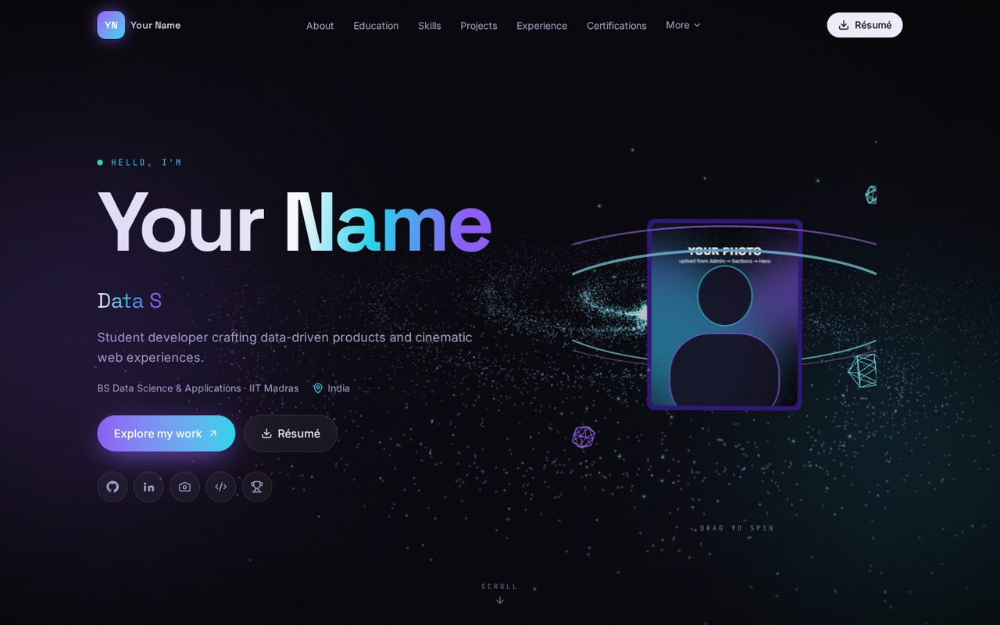

# 🌌 Cinematic 3D Portfolio + CMS

**A dark sci‑fi, cinematic personal portfolio with an interactive 3D hero — and a secure admin panel to manage every section, photo, certificate and project from the browser.**

*No code edits. No redeploys. Just log in and update.*

[](https://nextjs.org)
[](https://react.dev)
[](https://www.typescriptlang.org)
[](https://threejs.org)
[](https://gsap.com)
[](https://tailwindcss.com)
[](https://turso.tech)
[](LICENSE)

[**Features**](#-features) · [**Designs**](#-switchable-designs) · [**Screenshots**](#-screenshots) · [**Quick start**](#-quick-start) · [**Use it for yourself**](#-use-this-portfolio-for-yourself) · [**Deploy**](#-deployment) · [**AI**](#-ai-assistant) · [**Backups**](#-backups) · [**Admin guide**](#-admin-panel) · [**Roadmap**](#-roadmap)

</div>

---

## 📌 Project status

| | |
|---|---|
| **Version** | `v1.5.0` — personal content · Backup & Restore · deploy anywhere · AI assistant · **beta testers, Google sign-in, password reset & email alerts, drafts & scheduling, installable app, bulk import, “Ask about me” chat** ✅ |
| **Content** | Live content of Vinay Singh Chaudhary in [`content/vinay.json`](content/vinay.json) (`npm run content:apply`). New users still start from neutral demo data with `npm run setup`. |
| **Designs** | **43 layouts** across 13 sections — switch any section's design from the admin, preview before saving |
| **Quality** | TypeScript ✔ · ESLint ✔ · 55 unit tests ✔ (incl. backup → restore → undo, AI adapters & safety) · production build ✔ · every layout checked at 390 / 768 / 1440 px ✔ |
| **Next stage** | v1.5 — AI bulk import from résumé/LinkedIn · then public launch (see [Roadmap](#-roadmap)) |

> 📘 A 30‑page illustrated guide (architecture, workflows, every section's design + 6 alternatives, future ideas, prompts) lives at **[`docs/Portfolio-Project-Guide.pdf`](docs/Portfolio-Project-Guide.pdf)**.

---

## ✨ Features

<table>
<tr>
<td width="50%" valign="top">

### 🎬 Cinematic front‑end
- **Interactive 3D hero** — drag/swipe to spin a holographic photo card (front + back photo), orbit rings, floating crystals, sparkles
- **Particle galaxy background** (Three.js) that reacts to mouse & scroll
- **Cinematic intro**, glow cursor, film grain, smooth scrolling (Lenis)
- **Scroll storytelling** — GSAP pinned horizontal “film reel”, drawn timelines, animated counters
- **3D skill sphere** & **3D gallery ring**, tilt‑and‑glare cards
- Respects **reduced‑motion**; 3D is lazy‑loaded and lighter on phones

</td>
<td width="50%" valign="top">

### 🛠️ Full admin CMS
- **Turn any section on/off**, reorder it, rename it, hide it from the menu
- **Switch each section's design** — 43 layouts with visual picker & live preview
- Add / edit / hide / feature / reorder / delete **entries** in every section
- **Media library** — drag‑and‑drop photos & PDFs, automatic resize, alt text
- **Messages inbox** for the contact form
- **Site settings** — profile, résumé, socials, accent colours, effects, SEO, maintenance mode, privacy notice
- **Account security** — change password, forgot-password email, Google sign-in, sign out everywhere, activity log
- **Drafts & scheduled publishing** for every entry
- **Beta testers** — logins by email or WhatsApp invite; they preview the site during maintenance and beta-only sections
- **Bulk import** from a résumé (AI) or a LinkedIn export

</td>
</tr>
<tr>
<td valign="top">

### 🔐 Security built in
- bcrypt passwords, **rate limiting** & account lockout
- Signed, httpOnly session cookies — revocable at any time
- **CSRF** origin checks, strict **nonce‑based CSP**
- Uploads verified by file **bytes** (no SVG/HTML tricks)
- Safe Markdown, link allow‑list, no open redirects

</td>
<td valign="top">

### 🧭 Production‑ready UX
- Custom **404**, **500**, **maintenance**, **offline** and **session‑expired** states
- Empty states, “no results” with reset, loading & success feedback
- Forms keep your input after errors
- SEO: metadata, share image, JSON‑LD, sitemap, robots
- Accessible: skip link, labels, focus rings, keyboard dialogs

</td>
</tr>
</table>

### 🧩 13 switchable sections

| # | Section | Highlight |
|:-:|---|---|
| 0 | **Hero** | Draggable 3D portrait card · typing roles · CTA & résumé |
| 1 | **About** | Tilt photo · Markdown bio · animated stat counters |
| 2 | **Education** | Scroll‑drawn timeline · *Completed / Ongoing / Upcoming* |
| 3 | **Skills** | Interactive 3D tag sphere · category tabs · proficiency bars |
| 4 | **Projects** | Filters · search · featured layout · **case‑study page per project** |
| 5 | **Experience** | Internships, clubs, volunteering, leadership |
| 6 | **Certifications** | Image / PDF viewer · verify link · issuer filter |
| 7 | **Achievements** | GSAP pinned **horizontal film reel** |
| 8 | **Gallery** | Draggable **3D ring carousel** or masonry + lightbox |
| 9 | **Coming Soon** | Upcoming education, future projects & goals with progress |
| 10 | **Testimonials** | Infinite marquee of quotes |
| 11 | **Writing** | Article cards (Medium / LinkedIn / blog) |
| 12 | **Contact** | Secure form → admin inbox · socials · availability badge |

---

## 🎨 Switchable designs

Every section ships with **3–4 complete designs**. Pick one in **Admin → Sections & content → (section) → Design / layout** — the picker shows a real screenshot of each design, and **“Preview on site”** opens your live site with that design applied *only for you* before you save.

<p align="center">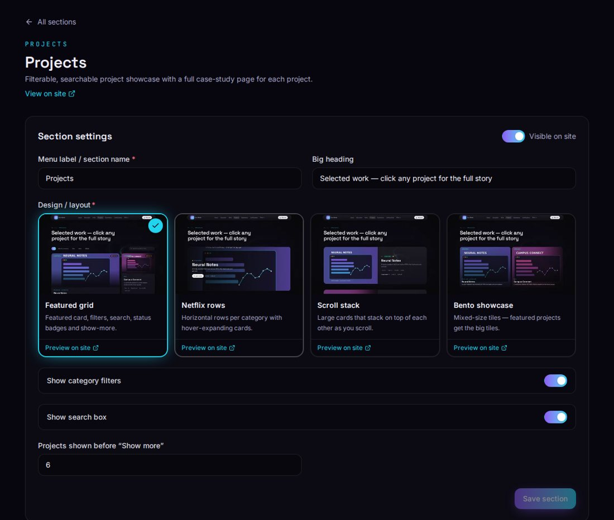</p>

<table>
<tr><th align="left" valign="middle">Hero</th><td align="center" width="25%">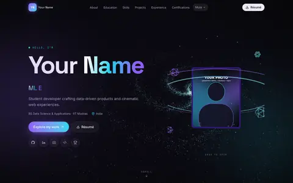<br/><sub><b>3D holo card</b> ⭐ default</sub></td><td align="center" width="25%">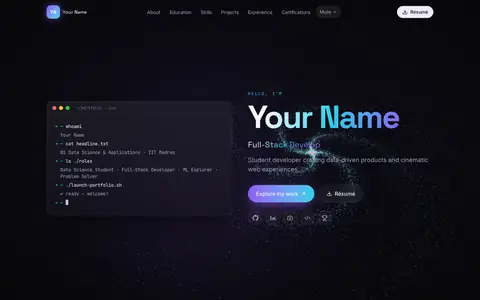<br/><sub><b>Terminal boot</b></sub></td><td align="center" width="25%">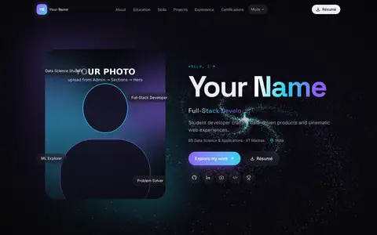<br/><sub><b>Split parallax</b></sub></td><td align="center" width="25%">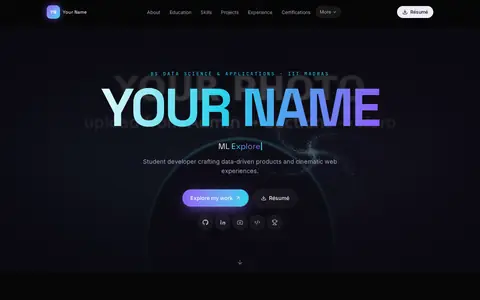<br/><sub><b>Cinematic letterbox</b></sub></td></tr>
<tr><th align="left" valign="middle">About</th><td align="center" width="25%">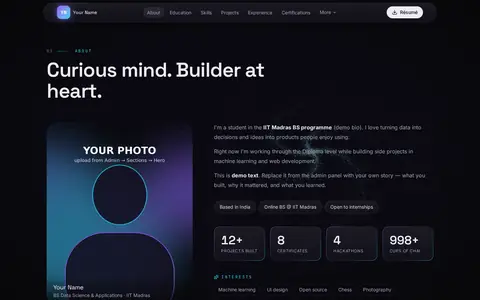<br/><sub><b>Photo + story</b> ⭐ default</sub></td><td align="center" width="25%">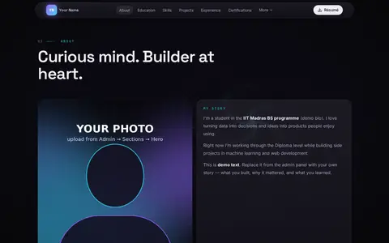<br/><sub><b>Bento grid</b></sub></td><td align="center" width="25%">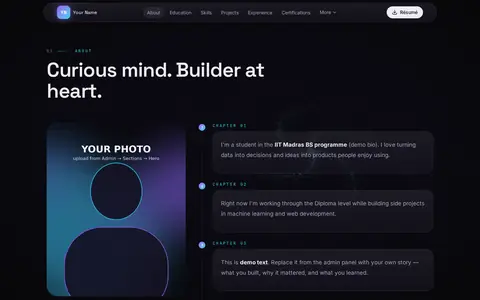<br/><sub><b>Story chapters</b></sub></td><td></td></tr>
<tr><th align="left" valign="middle">Education</th><td align="center" width="25%">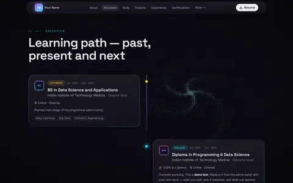<br/><sub><b>Glowing timeline</b> ⭐ default</sub></td><td align="center" width="25%">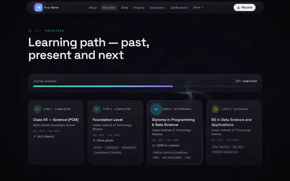<br/><sub><b>Level tracker</b></sub></td><td align="center" width="25%">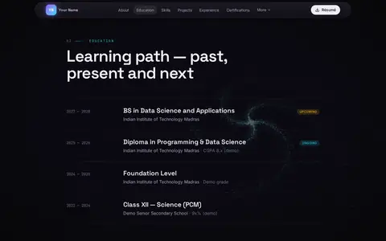<br/><sub><b>Minimal list</b></sub></td><td></td></tr>
<tr><th align="left" valign="middle">Skills</th><td align="center" width="25%">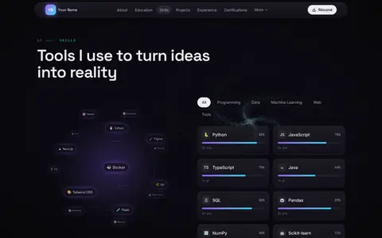<br/><sub><b>3D sphere + bars</b> ⭐ default</sub></td><td align="center" width="25%">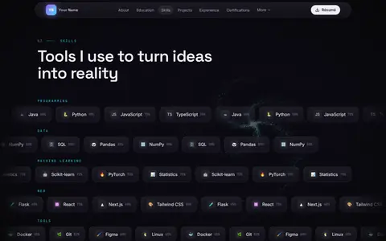<br/><sub><b>Logo marquee</b></sub></td><td align="center" width="25%">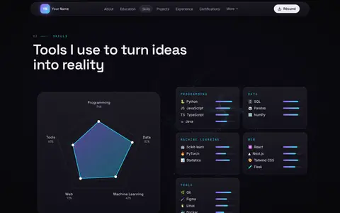<br/><sub><b>Radar chart</b></sub></td><td align="center" width="25%">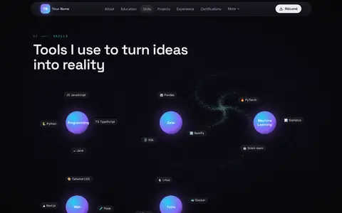<br/><sub><b>Orbit planets</b></sub></td></tr>
<tr><th align="left" valign="middle">Projects</th><td align="center" width="25%">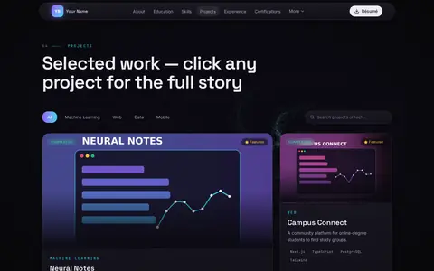<br/><sub><b>Featured grid</b> ⭐ default</sub></td><td align="center" width="25%">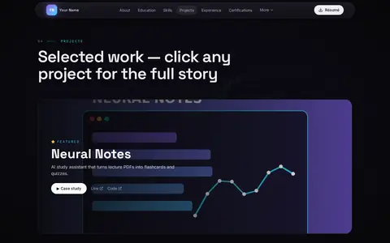<br/><sub><b>Netflix rows</b></sub></td><td align="center" width="25%">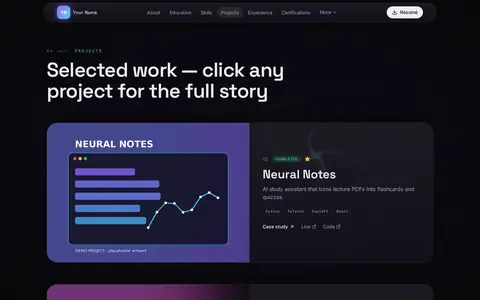<br/><sub><b>Scroll stack</b></sub></td><td align="center" width="25%">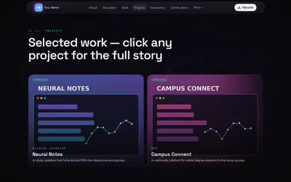<br/><sub><b>Bento showcase</b></sub></td></tr>
<tr><th align="left" valign="middle">Experience</th><td align="center" width="25%">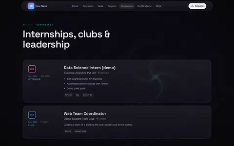<br/><sub><b>Cards</b> ⭐ default</sub></td><td align="center" width="25%">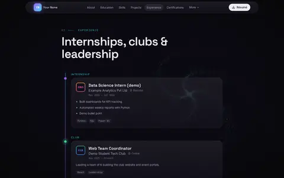<br/><sub><b>Vertical timeline</b></sub></td><td align="center" width="25%">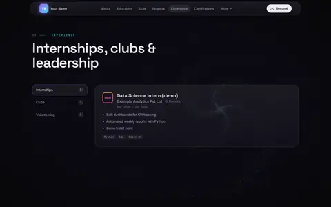<br/><sub><b>Tabs by type</b></sub></td><td></td></tr>
<tr><th align="left" valign="middle">Certifications</th><td align="center" width="25%">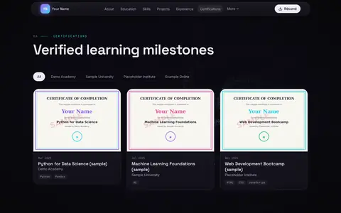<br/><sub><b>Tilt cards</b> ⭐ default</sub></td><td align="center" width="25%">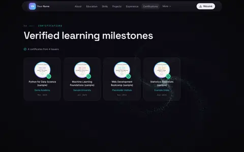<br/><sub><b>Badge wall</b></sub></td><td align="center" width="25%">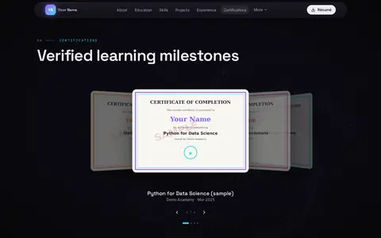<br/><sub><b>Coverflow carousel</b></sub></td><td></td></tr>
<tr><th align="left" valign="middle">Achievements</th><td align="center" width="25%">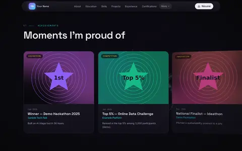<br/><sub><b>Film reel</b> ⭐ default</sub></td><td align="center" width="25%">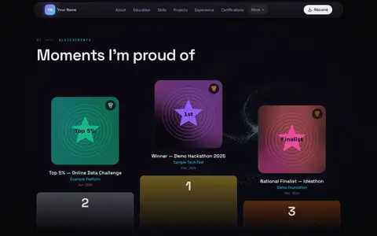<br/><sub><b>Medal podium</b></sub></td><td align="center" width="25%">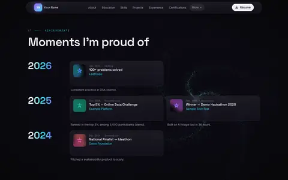<br/><sub><b>Year timeline</b></sub></td><td></td></tr>
<tr><th align="left" valign="middle">Gallery</th><td align="center" width="25%">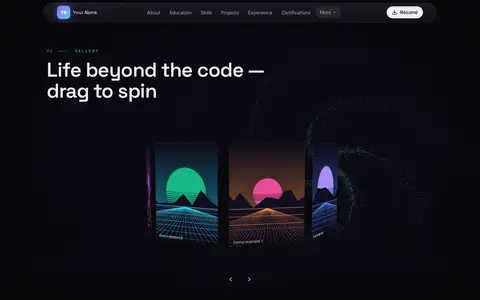<br/><sub><b>3D ring</b> ⭐ default</sub></td><td align="center" width="25%">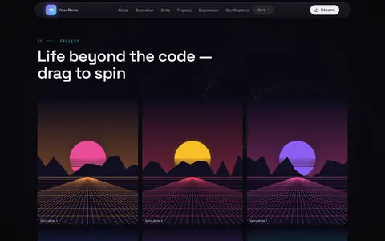<br/><sub><b>Masonry grid</b></sub></td><td align="center" width="25%">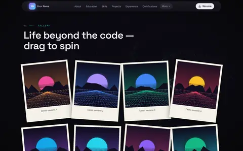<br/><sub><b>Polaroid scatter</b></sub></td><td align="center" width="25%">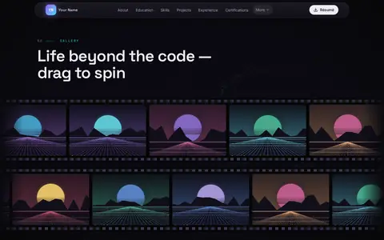<br/><sub><b>Film strip</b></sub></td></tr>
<tr><th align="left" valign="middle">Coming Soon</th><td align="center" width="25%">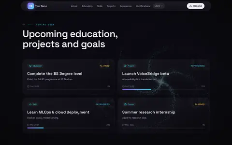<br/><sub><b>Trailer cards</b> ⭐ default</sub></td><td align="center" width="25%">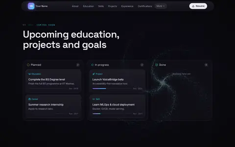<br/><sub><b>Kanban board</b></sub></td><td align="center" width="25%">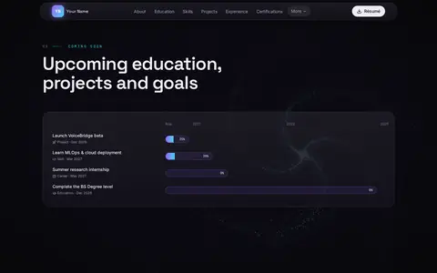<br/><sub><b>Timeline bars</b></sub></td><td></td></tr>
<tr><th align="left" valign="middle">Testimonials</th><td align="center" width="25%">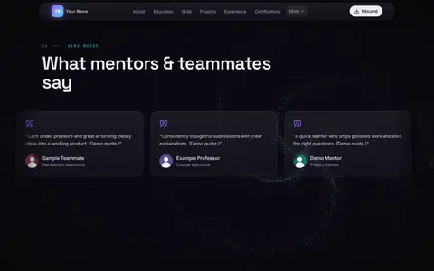<br/><sub><b>Marquee</b> ⭐ default</sub></td><td align="center" width="25%">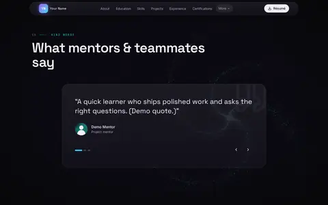<br/><sub><b>Spotlight slider</b></sub></td><td align="center" width="25%">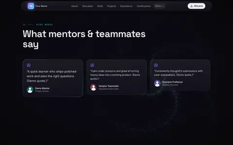<br/><sub><b>Wall of love</b></sub></td><td></td></tr>
<tr><th align="left" valign="middle">Writing</th><td align="center" width="25%">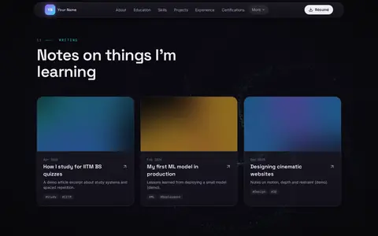<br/><sub><b>Cards</b> ⭐ default</sub></td><td align="center" width="25%">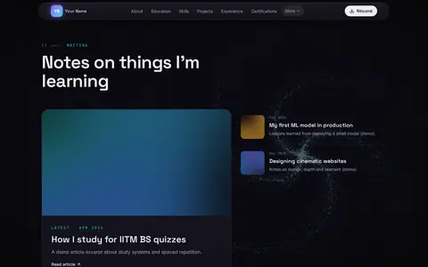<br/><sub><b>Featured + list</b></sub></td><td align="center" width="25%">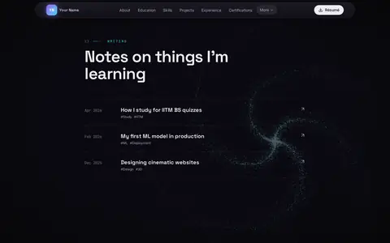<br/><sub><b>Minimal list</b></sub></td><td></td></tr>
<tr><th align="left" valign="middle">Contact</th><td align="center" width="25%">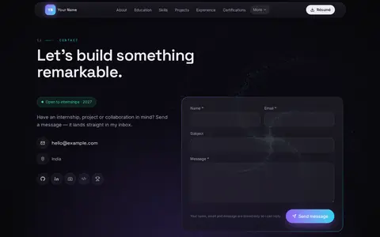<br/><sub><b>Form + details</b> ⭐ default</sub></td><td align="center" width="25%">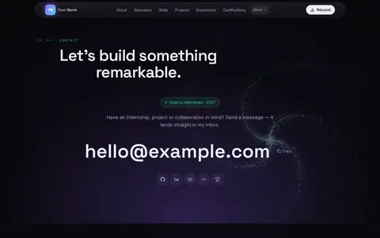<br/><sub><b>Big email</b></sub></td><td align="center" width="25%">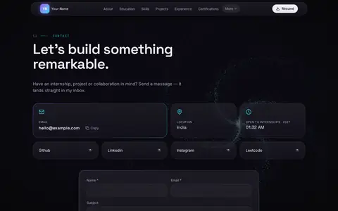<br/><sub><b>Contact cards</b></sub></td><td></td></tr>
</table>

**How it works:** the design catalogue lives in [`src/lib/layouts.ts`](src/lib/layouts.ts). The admin picker, server validation (only catalogue values are accepted) and the public renderer all read it, and visitors only download the code of the design you chose. Your content is shared by all designs — switching never loses data.

---

## 📸 Screenshots

<div align="center">

### The 3D hero — drag to spin
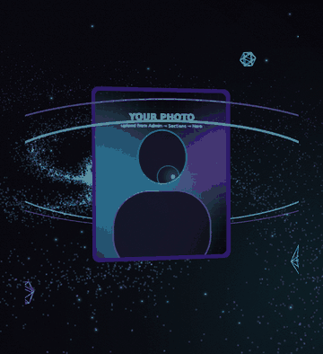

</div>

<table>
<tr>
<td width="50%">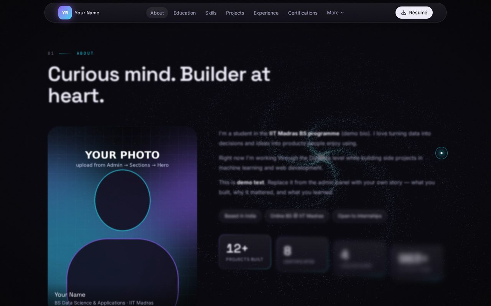<p align="center"><b>About</b> — tilt photo, bio, animated counters</p></td>
<td width="50%">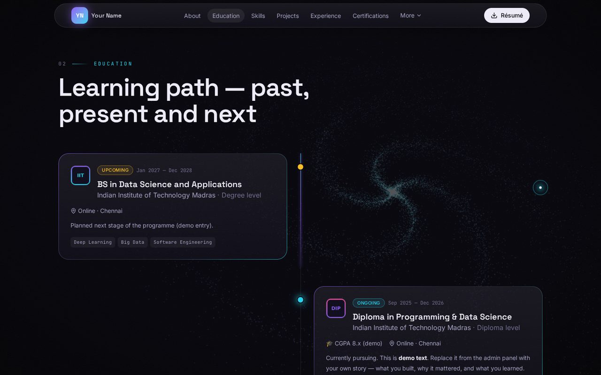<p align="center"><b>Education</b> — timeline with status badges</p></td>
</tr>
<tr>
<td>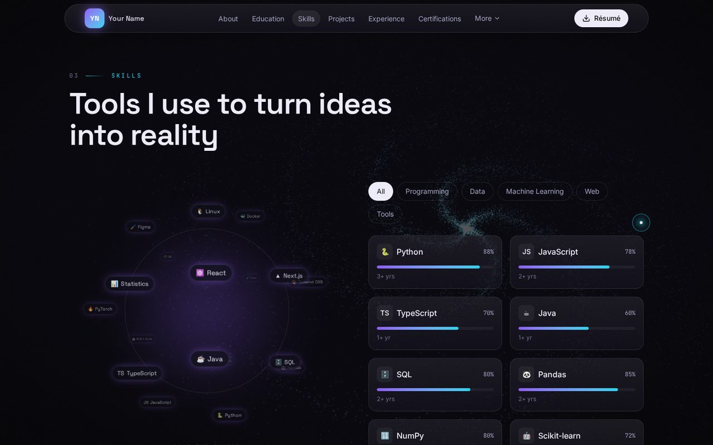<p align="center"><b>Skills</b> — 3D sphere + proficiency bars</p></td>
<td>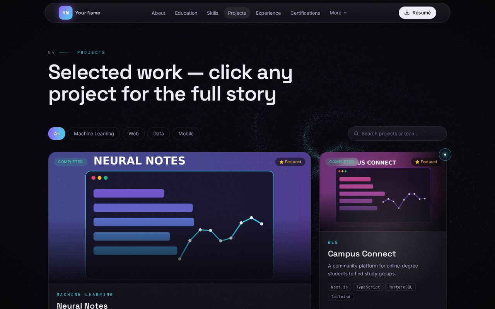<p align="center"><b>Projects</b> — filters, search, featured card</p></td>
</tr>
<tr>
<td><p align="center"><b>Certifications</b> — uploaded certificates</p></td>
<td><p align="center"><b>Certificate viewer</b> — verify link & PDF</p></td>
</tr>
<tr>
<td><p align="center"><b>Achievements</b> — horizontal film reel</p></td>
<td><p align="center"><b>Gallery</b> — draggable 3D ring</p></td>
</tr>
<tr>
<td><p align="center"><b>Coming Soon</b> — future goals & progress</p></td>
<td><p align="center"><b>Experience</b> — internships & clubs</p></td>
</tr>
<tr>
<td><p align="center"><b>Testimonials</b> — marquee</p></td>
<td><p align="center"><b>Writing</b> — article cards</p></td>
</tr>
<tr>
<td><p align="center"><b>Contact</b> — secure form → inbox</p></td>
<td><p align="center"><b>Case‑study page</b> — <code>/projects/[slug]</code></p></td>
</tr>
</table>

### 📱 Fully responsive


Tested at **320, 375, 414, 768, 1024, 1280 and 1920 px** — no horizontal scrolling on any public or admin page.

### 🛠️ Admin panel

<table>
<tr>
<td width="50%"><p align="center"><b>Dashboard</b> — stats & launch checklist</p></td>
<td width="50%"><p align="center"><b>Sections</b> — on/off switches & ordering</p></td>
</tr>
<tr>
<td><p align="center"><b>Entries</b> — hide, feature, reorder, delete</p></td>
<td><p align="center"><b>Editor</b> — forms generated automatically</p></td>
</tr>
<tr>
<td><p align="center"><b>Media library</b> — drag & drop uploads</p></td>
<td><p align="center"><b>Settings</b> — profile, colours, SEO, maintenance</p></td>
</tr>
<tr>
<td><p align="center"><b>Messages</b> — contact inbox</p></td>
<td><p align="center"><b>Account</b> — password, sessions, activity log</p></td>
</tr>
<tr>
<td><p align="center"><b>Sign‑in</b> — rate‑limited & lockout‑protected</p></td>
<td><p align="center"><b>404</b> — custom “scene doesn't exist” page</p></td>
</tr>
</table>

---

## 🧰 Tech stack

| Layer | Technology |
|---|---|
| Framework | **Next.js 16** (App Router, server rendering) · **React 19** · **TypeScript** |
| Styling | **Tailwind CSS 4** · self‑hosted Space Grotesk, Inter, JetBrains Mono |
| 3D & motion | **Three.js** · **React Three Fiber** · **drei** · **GSAP ScrollTrigger** · **Framer Motion** · **Lenis** |
| Data | **Drizzle ORM** · **libSQL** — SQLite file locally, **Turso** in the cloud |
| Auth & security | **bcrypt** · **jose** (signed JWT cookie) · **Zod** validation · nonce CSP |
| File storage | Local disk (`data/uploads`) or **Vercel Blob** |
| Quality | **Vitest** · **ESLint** · TypeScript strict |

---

## 🏗️ Architecture


```mermaid
flowchart LR
    V["👀 Visitor<br/>phone · tablet · desktop"] --> P
    A["🧑‍💻 You (admin)<br/>/admin"] --> P
    P["proxy.ts<br/>CSP nonce · /admin guard"] --> N

    subgraph N["Next.js 16 server — one app"]
        S["Public site<br/>13 sections · SSR"]
        C["Admin CMS<br/>forms from registry"]
        API["API routes /api/*<br/>Zod · CSRF · rate limits"]
        R["Section registry<br/>registry.ts"]
    end

    API --> DB[("Database<br/>SQLite file ⟷ Turso")]
    S --> DB
    API --> FS[("Files<br/>data/uploads ⟷ Vercel Blob")]
    R -. defines fields .-> C
    R -. validates .-> API
    R -. renders .-> S
```

**How an edit goes live**


```mermaid
sequenceDiagram
    participant You as You (browser)
    participant UI as Admin UI
    participant API as API route
    participant DB as Database
    You->>UI: Edit a project, click Save
    UI->>API: PATCH /api/admin/items/:id
    API->>API: Check origin (CSRF) + session
    API->>API: Validate against registry (Zod)
    API->>DB: UPDATE item + audit log
    API-->>UI: 200 OK (or 400 + field errors)
    UI-->>You: “Saved” toast — live on next page load
```

> 💡 **The section registry** (`src/lib/registry.ts`) defines every section's fields **once**. The admin form, the server validation and the public page all read it — add a field there and it appears everywhere.

---

## 🚀 Quick start

### Prerequisites
- **[Node.js 20.9+](https://nodejs.org)** (LTS recommended) — check with `node -v`
- **Git** — <https://git-scm.com>
- A code editor — **VS Code** recommended

### Run it locally (3 commands)

```bash
npm install        # 1 · install dependencies
npm run setup      # 2 · create database, demo content and your admin login
npm run dev        # 3 · start the dev server
```

| Open | URL |
|---|---|
| 🌐 Website | <http://localhost:3000> |
| 🔐 Admin panel | <http://localhost:3000/admin> |

`npm run setup` **prints your admin email and a generated password** (also stored in the private, git‑ignored `.env.local`). Sign in, then change the password under **Account & security**.

> ⚠️ **Windows + WSL users:** don't run the project from `/mnt/c/...` or `/mnt/d/...` inside WSL — file access there is very slow (installs and page compiles take minutes). Use a normal Windows terminal (PowerShell / VS Code), or keep the project inside your WSL home folder (`~/projects/...`).

---

## 🙋 Use this portfolio for yourself

Anyone can download this project and turn it into their own portfolio.

**1 · Get the code** — pick one:

```bash
# a) Clone with Git
git clone https://github.com/VinaySinghChaudhary1/my-cinematic-portfolio.git
cd my-cinematic-portfolio
```

- **b) Fork** — click **Fork** on GitHub to get your own copy, then clone your fork.
- **c) Download ZIP** — **Code → Download ZIP** on GitHub, unzip, open the folder in VS Code.

**2 · Install & set up**

```bash
npm install
npm run setup
npm run dev
```

> Want your own admin email from the start? Before `npm run setup`, copy `.env.example` to `.env.local` and set `ADMIN_EMAIL` and a strong `ADMIN_PASSWORD` (12+ characters, upper‑ and lower‑case letters and numbers).

**3 · Make it yours — all from the browser** at `/admin`:

1. **Site settings → Profile** — name, initials, headline, tagline, email, photo, résumé PDF
2. **Site settings → Social links** — leave any field empty to hide its icon
3. **Sections & content** — edit each section; switch off the ones you don't need yet
4. **Hero → 3D portrait photos** — upload two vertical (4:5) photos for the front and back of the card
5. **Site settings → Appearance** — accent colours and effects
6. **Site settings → Privacy notice** — write your real details, then publish
7. **Site settings → SEO** — turn on search indexing when you're ready to launch

Start over any time with `npm run setup -- --reset` (content is reset; your admin account and uploads are kept).

**Prefer files over clicking?** Put your whole site in one JSON file (see [`content/README.md`](content/README.md)), keep your images in `public/me/`, and run:

```bash
npm run content:check   # validate the file + check every image exists
npm run content:apply   # back up the current content, then apply the file
```

---

## 👤 Personal content (this site)

| File | Purpose |
|---|---|
| [`content/vinay.json`](content/vinay.json) | Every section, item, design choice and profile setting of the live site |
| [`content/README.md`](content/README.md) | How the content file works, field reference, local vs. live (Turso) |
| [`content/UPDATE_REQUEST.md`](content/UPDATE_REQUEST.md) | Fill‑in template for future updates — send it to Claude with new files |
| [`content/BRAND.md`](content/BRAND.md) | 4 logo options, headline/tagline alternatives, colours |
| `public/me/` | Photos, hero video, certificates, generated project covers, logos, résumé |
| `scripts/art/generate-art.py` | Regenerates project covers, achievement tiles, journey cards and the share image |

---

## 🐙 First push to GitHub

1. Create an **empty** repository at <https://github.com/new> (no README, no .gitignore — this project already has them).
2. In the project folder run:

```bash
git init -b main
git add .
git commit -m "feat: cinematic 3D portfolio with admin CMS (v1.0.0)"
git remote add origin https://github.com/VinaySinghChaudhary1/my-cinematic-portfolio.git
git push -u origin main
```

`.gitignore` already keeps secrets and local data out of Git: `.env.local`, `data/*.db`, `data/uploads/`, `node_modules/` and `.next/` are never committed.

---

## ☁️ Deployment

Runs on **any host with Node.js 20+ or Docker** — the same code picks the right database and file storage from environment variables, and creates its tables, demo content and admin account on first start (no shell needed).

| Host | Database | Files | Scheduled backups |
|---|---|---|---|
| **Vercel** | Turso | Vercel Blob | Vercel Cron (`vercel.json`) |
| **VPS** — Hostinger VPS, DigitalOcean, EC2, Hetzner… | SQLite in `DATA_DIR` | disk | built-in timer |
| **Docker** — `docker compose up -d` | SQLite in a volume | volume | built-in timer |
| **Hostinger Node.js web app** | SQLite in `DATA_DIR` outside the build folder, or Turso | disk, or Cloudflare R2 / S3 | built-in timer |
| **Render / Railway / Fly.io** | SQLite on a persistent disk, or Turso | disk, or R2 / S3 | built-in timer |
| **Netlify / other serverless** | Turso | R2 / S3 / Blob | GitHub Actions or any cron → `/api/cron/backup` |

📄 Step-by-step for every host, all environment variables and "moving to another host": **[`docs/DEPLOYMENT.md`](docs/DEPLOYMENT.md)**

### Quick Vercel deploy

1. Import the repo at [vercel.com/new](https://vercel.com/new).
2. Create a [Turso](https://turso.tech) database → set `DATABASE_URL` + `DATABASE_AUTH_TOKEN`.
3. Vercel → Storage → **Blob** (adds `BLOB_READ_WRITE_TOKEN`).
4. Set `AUTH_SECRET` (48+ random chars), `SITE_URL`, `ADMIN_EMAIL`, `ADMIN_PASSWORD`, `CRON_SECRET` → Deploy.
5. Sign in at `/admin` → **Backups → Restore from a file** to load your content.

---

## ✨ AI assistant

Connect **Claude, Gemini, OpenAI** and as many **OpenAI-compatible** services as you like (OpenRouter, Groq, Together, Ollama…) with your own API keys in **Admin → AI assistant**:

- **✨ Fill with AI** on every form — rough notes, pasted text, a certificate PDF or a screenshot → correctly formatted fields you review and tick
- **✨ AI** on long text — write, improve, make professional, shorten, expand, fix grammar, or your own instruction
- **✨ Generate** on image fields — logos & icons (vector, any provider), covers & artwork (Gemini / OpenAI image models) in your site's colours
- **Order & automatic fallback** — when one provider is out of credit or busy, the next one takes over; or pick a provider per request in each dialog
- Any current or future model name works; **Load models** lists what your key can use
- No in-app spending cap — when your key's limit is exhausted you see the provider's own message
- Keys encrypted at rest, never shown again, never in backups; every AI answer is re-validated like manual input

📄 Guide: **[`docs/AI-ASSISTANT.md`](docs/AI-ASSISTANT.md)**

---

## 🔑 Access, email & beta (v1.5)

- **Beta testers** — Admin → Beta testers creates a login and sends it by email or WhatsApp; testers see the site during maintenance, beta-only sections and (optionally) drafts, and send feedback
- **Forgot password** & **"password changed"** emails, **new-message alerts** — via [Resend](https://resend.com) (optional `RESEND_API_KEY`)
- **Continue with Google** for you and your testers (optional `GOOGLE_CLIENT_ID` / `GOOGLE_CLIENT_SECRET`)
- **Drafts & scheduling** · **installable app with offline cache** · **bulk import** from résumé/LinkedIn · **"Ask about me" chat** (off until you switch it on)

📄 Setup: **[`docs/EMAIL-AND-ACCESS.md`](docs/EMAIL-AND-ACCESS.md)**

---

## 💾 Backups

**Admin → Backups** saves the whole website in one file — every section, item and chosen design, site settings, uploaded media, the bundled photos/video/certificates, and (optionally) contact messages and the activity log.

- **Choose what to include** — all or some sections, settings, media, site files, messages, activity log
- **Password-protected downloads** (AES-256-GCM, on by default) — downloads/uploads go in 4 MB parts, so they work on every host
- **Restore from a file or from history** — every file is checksum-verified, then you see a **preview** (items now vs. in the backup) and choose: all sections or only some, settings, media, messages
- **Safe by design** — admin password + typing `RESTORE`, maintenance mode while it runs, one database transaction, automatic **snapshot first → one-click Undo**
- **Moves between hosts** — files are re-uploaded to the new storage and every link in the content is rewritten
- **Automatic backups (optional)** — daily / weekly / monthly, keep the last *N*; triggered by the built-in timer, Vercel Cron or any cron URL
- **Command line** — `npm run backup [-- --password "…"]` · `npm run restore -- file.zip [--password "…"] --yes`
- Never included: password hashes, `AUTH_SECRET`, `.env` values

<p align="center"></p>

---

## 🔐 Admin panel

| | |
|---|---|
| **Where** | `/admin` — e.g. <http://localhost:3000/admin> or `https://your-domain/admin` |
| **Login button?** | Not shown publicly by default. Optional: *Site settings → Footer → Show a small “Admin” link* |
| **Default password?** | None — `npm run setup` generates one and prints it (also in `.env.local`) |
| **Forgot password** | `npm run admin:reset-password -- you@example.com "NewStrongPass2026"` |
| **Sign out everywhere** | *Account & security → Sign out of all devices* |

---

## 📜 Scripts

| Command | What it does |
|---|---|
| `npm run dev` | Development server with hot reload |
| `npm run build` · `npm start` | Production build · production server |
| `npm run setup` | Create database + demo content + admin account |
| `npm run setup -- --reset` | Reset content to the demo data (keeps admin + uploads) |
| `npm run content:check` · `content:apply` · `content:export` | Validate · apply · back up the JSON content file |
| `npm run backup` · `npm run restore -- <file>` | Full-site backup to `backups/` · preview / restore a backup file (`--yes` to apply) |
| `npm run admin:reset-password -- <email> "<password>"` | Reset the admin password offline |
| `npm test` | Unit tests (Vitest) |
| `npm run lint` · `npm run typecheck` | ESLint · TypeScript |

---

## 📁 Project structure

```text
cinematic-portfolio/
├── src/
│   ├── app/
│   │   ├── (site)/              # public pages: home, projects/[slug], privacy
│   │   ├── admin/               # login + dashboard, sections, media, messages, settings, account
│   │   ├── api/                 # auth, admin CRUD, contact, health
│   │   ├── media/[...path]/     # safe serving of local uploads
│   │   └── layout.tsx · not-found.tsx · error.tsx · robots.ts · sitemap.ts
│   ├── components/
│   │   ├── site/                # navbar, footer, preloader, galaxy, cursor, sections/*
│   │   ├── admin/               # admin shell, section editor, dynamic form, media picker…
│   │   └── ui/                  # modal, markdown, states, social icons
│   ├── lib/
│   │   ├── registry.ts          # ★ section types & their fields
│   │   ├── settings-def.ts      # ★ site settings groups
│   │   ├── validation.ts        # Zod builders, URL safety
│   │   └── server/              # auth, sessions, rate limiting, storage, content queries
│   ├── db/                      # schema, migrations, demo seed data
│   └── proxy.ts                 # security headers + admin guard
├── scripts/                     # setup, reset-password, demo image generator
├── public/demo/                 # placeholder artwork
├── docs/                        # guide PDF, plan, deployment, audit, screenshots
└── tests/                       # unit tests
```

### Extending

- **Add a field** to a section → add it to that section in `src/lib/registry.ts`, then show it in `src/components/site/sections/<Section>.tsx`. The admin form and validation update automatically.
- **Add a new design** for a section → add an entry to `src/lib/layouts.ts`, build the component in `src/components/site/sections/variants/`, register it in `SectionRenderer.tsx`, and add a thumbnail to `public/layouts/<section>-<layout>.webp`.
- **Add a new section** → add a type to the registry, create its component, register it in `SectionRenderer.tsx`, add demo data in `src/db/seed-data.ts`.

---

## 🛡️ Security

| Threat | Protection |
|---|---|
| Password guessing | bcrypt (cost 12), per‑IP & per‑email rate limits, 15‑minute lockout |
| Account discovery | Identical errors and timing for unknown emails |
| Session theft | httpOnly + SameSite cookies, Secure on HTTPS, revocable session version |
| CSRF | Origin must match on every change request |
| XSS | Nonce‑based Content‑Security‑Policy, Markdown without raw HTML, link allow‑list |
| Malicious uploads | Type detected from bytes, SVG/HTML refused, size limits, sandboxed serving |
| Spam | Honeypot, minimum fill time, 5 messages / hour / IP |

Found a security issue? Please open a private security advisory on GitHub instead of a public issue.

---

## 🗺️ Roadmap

- [x] **Stage 1 — Foundation:** cinematic site, 13 sections, admin CMS, security, error states, tests, docs
- [x] **v1.1 — Switchable designs:** 43 layouts, visual picker with thumbnails, admin‑only live preview
- [x] **Stage 2 — Personalise:** real photos, bio, education, projects, certificates (v1.2.0) — privacy notice still to write in Admin → Settings
- [x] **v1.3 — Backup & deploy anywhere:** full-site backup/restore/undo, schedules, Docker, VPS, Hostinger, S3/R2 storage
- [x] **v1.4 — AI assistant:** fill any form, write/polish text, generate logos/icons/covers with your own Claude / Gemini / OpenAI key
- [x] **v1.5 — Access & content tools:** beta testers, Google sign-in, password reset & email alerts, drafts & scheduling, installable app, bulk import, “Ask about me” chat
- [x] **Stage 3 — Launch:** custom domain on Vercel
- [ ] **Stage 4 — Grow:** built‑in blog editor, GitHub/LeetCode stats, analytics, two‑factor login
- [ ] **Stage 5 — Future‑ready:** theme presets, 3D avatar, multi‑language

See [`CHANGELOG.md`](CHANGELOG.md) for what changed in each version.

---

## 🤝 Contributing

Suggestions and improvements are welcome — see [`CONTRIBUTING.md`](CONTRIBUTING.md). Please run `npm run lint && npm run typecheck && npm test` before opening a pull request.

## 📄 License

Released under the [MIT License](LICENSE). Demo artwork in `public/demo/` is generated by `scripts/gen_demo_images.py` and free to reuse.

<div align="center">

**Built with ❤️, Next.js, Three.js and GSAP**

⭐ If this project helps you, consider giving it a star!

</div>
